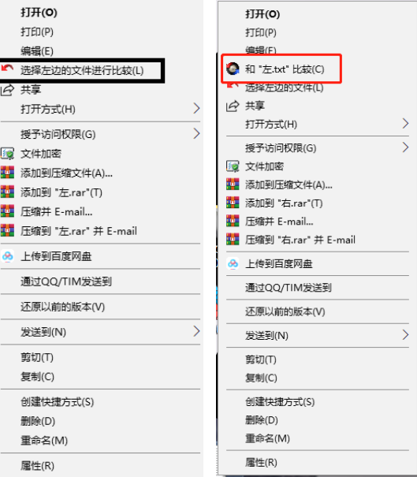
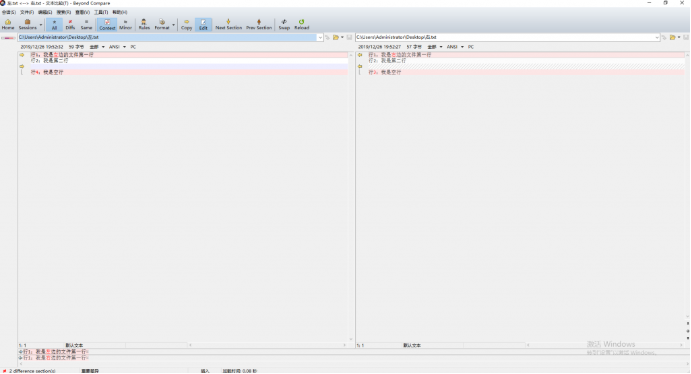
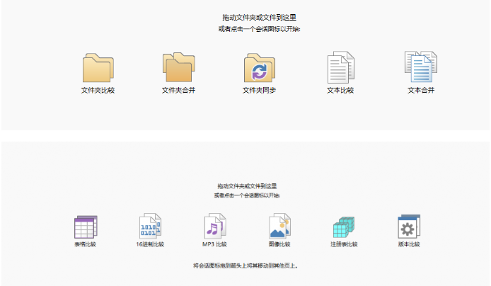

日常工作中经常会遇到两个文件比较同步的问题，经常对比对到眼瞎，而且时常出篓子，运用小工具，提高工作效率。Beyond Compare是一款只有10M左右的小软件，但是功能非常强大，安装完成，会在文件的右键菜单增加两个菜单

首先，选择一个文件，右击【选择左边的文件进行比较】，然后选择比较的另一个文件，右击【和“XX”进行比较】

此时会在同一个面显示两个文件的内容，根据需要，可以选择只显示相同内容，只显示不同内容，或者显示全部，软件支持将一边某些行直接复制到另一边，除了这些以外，软件还支出文件比较，同步，excel比较等等

更多功能以及使用技巧，在使用过程中慢慢探索！
